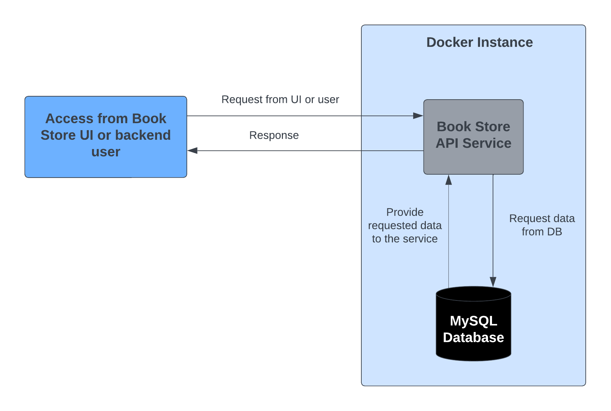

# Book Store Service

This is a microservice application which is expose below mentioned operations related to the book.

1. Get all books in the store.
2. Get book by book id.
3. Get books by author id.
4. Get books by volume which are greater than given volume number.
5. Get books by volume which are less than given volume number.
6. Get books by generation.
7. Create new book.
8. Update an existing book.
9. Delete an existing book.

## Architecture of the Service

This microservice is created using below mentioned technologies stack.

1. Spring Boot 2.7.5-RELEASE.
2. Spring Data JPA.
3. MySQL – version 8.0.
4. Docker - version 20.10.23.
5. Docker Compose - version 2.15.1.

This is a docker based application and docker imagers created for both api and the mysql db. After container is started, we can access the API's in the application.

Below image shows the simple atchitecture of the application.

